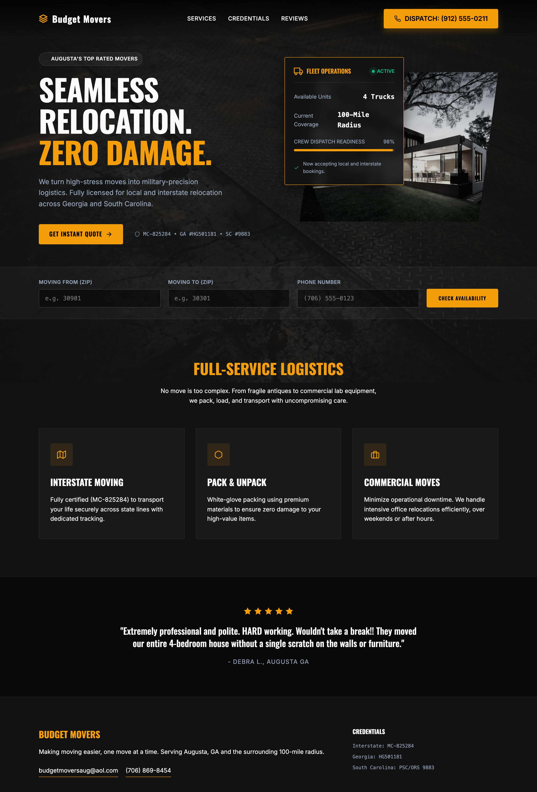
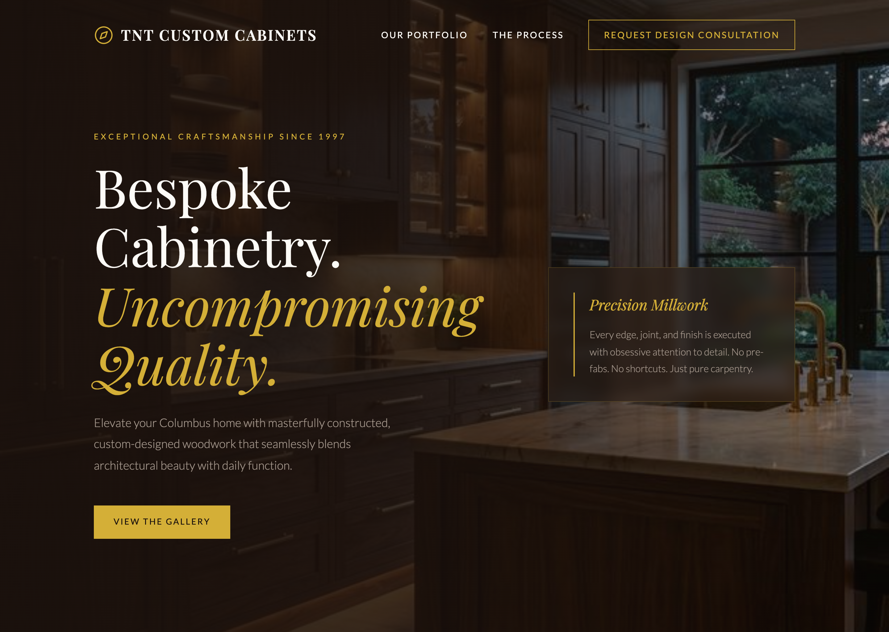
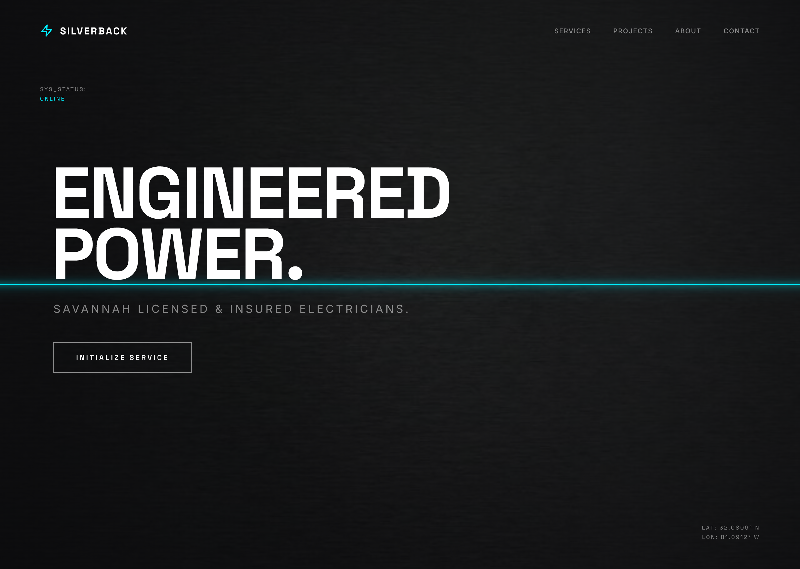
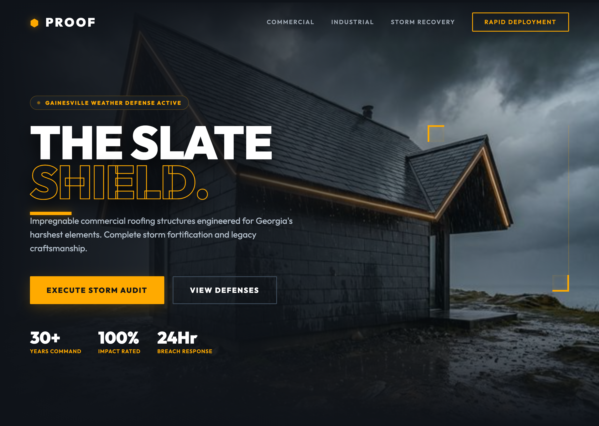
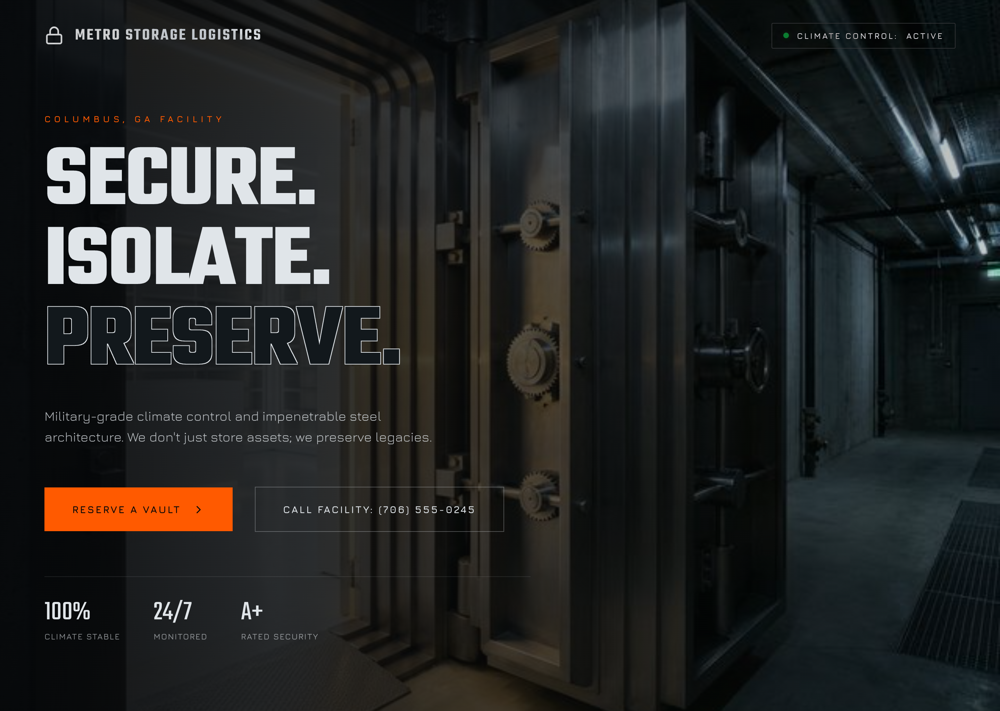
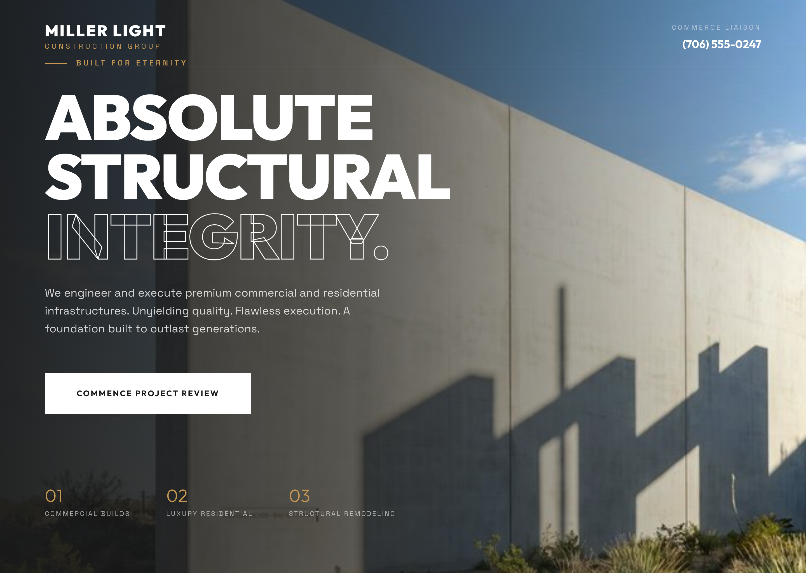
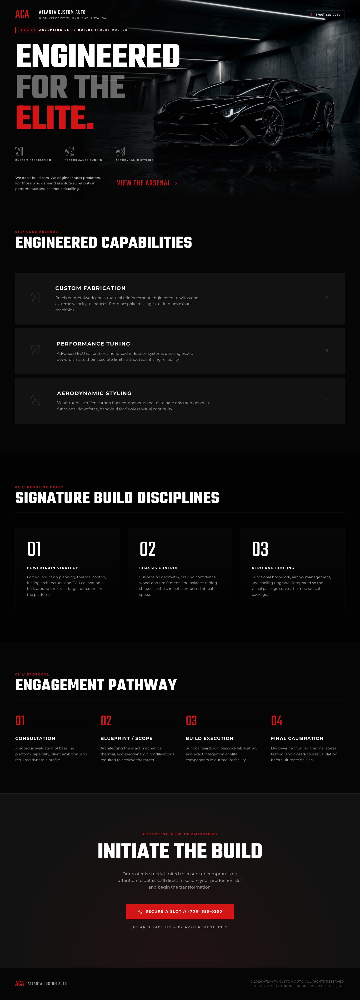

# Frontend Design Loop MCP

<!-- mcp-name: io.github.alexalexalex222/frontend-design-loop-mcp -->

Coding agents can get a page functional. Frontend Design Loop makes it materially better with screenshot-grounded iteration and proof artifacts.

Use it when the base model got the page working but the result is still generic, flat, rough, or visibly under-designed. The main design workflow stays on one main provider and model lane by default, so multi-model routing is opt-in instead of the default story.

## Quick Start

Install the current public build from PyPI:

```bash
pipx install frontend-design-loop-mcp
```

Set up every detected supported client:

```bash
frontend-design-loop-setup --install-all-detected-clients
```

Real MCP call example:

```text
frontend_design_loop_design(
  repo_path="/absolute/path/to/site",
  goal="make the homepage look materially more premium without changing the information architecture",
  provider="gemini_cli",
  model="gemini-3.1-pro-preview",
  preview_command="python3 -m http.server {port}",
  preview_url="http://127.0.0.1:{port}/index.html"
)
```

## What The MCP Does

`frontend_design_loop_design` is the main workflow:
- the host agent points the MCP at a real repo plus a concrete design goal
- the MCP boots a local preview, captures screenshots, and iterates against the rendered result
- the same main provider and model lane is used by default across planning, generation, and vision unless you explicitly override it
- the MCP returns the winning patch plus screenshots and run artifacts

`frontend_design_loop_eval` is the proof workflow:
- use it when the host agent already has the patch
- the MCP applies the patch in an isolated worktree, runs deterministic checks, captures screenshots, and returns proof artifacts

This is the wedge:
- coding agents can already get pages working
- this MCP helps them make pages materially better
- screenshot-grounded iteration plus proof artifacts is the differentiator

Official MCP Registry metadata is tracked in [`server.json`](server.json).

## Proof Gallery

The public proof set uses owned/generated GA SMB previews plus the ACA full-page before/after.

### Selected Desktop Previews

<table>
  <tr>
    <td align="center"><br><sub>11 Budget Movers Augusta</sub></td>
    <td align="center"><br><sub>13 Peachtree Flooring Atlanta</sub></td>
    <td align="center"><br><sub>19 TNT Cabinets Columbus</sub></td>
  </tr>
  <tr>
    <td align="center"><br><sub>21 Henry Plumbing Savannah</sub></td>
    <td align="center"><br><sub>22 Silverback Electric Savannah</sub></td>
    <td align="center"><br><sub>25 Robins Body &amp; Paint Warner Robins</sub></td>
  </tr>
  <tr>
    <td align="center"><br><sub>34 Proof Roofing Services Gainesville</sub></td>
    <td align="center"><br><sub>45 Metro Storage Columbus</sub></td>
    <td align="center"><br><sub>47 Miller Light Construction Commerce</sub></td>
  </tr>
</table>

### ACA Full-Page Before / After

Before: early ACA full homepage.



After: rebuilt ACA homepage with a stronger hero, cleaner sequencing, and a materially better full-page result.


See the proof notes in [the case studies index](docs/case-studies/index.md).

## How It Works In Practice

1. Point the MCP at a real repo and give it a concrete design goal.
2. It creates an isolated worktree, boots a preview, and captures rendered screenshots.
3. It iterates against the actual rendered page instead of only raw code.
4. It returns the winning patch, screenshot proof, and run artifacts so the host agent can judge the result.

## Workflow Summary

### `frontend_design_loop_design`

Use it when:
- the page is functional but weak
- the section structure is there but the design is not
- you want the MCP to improve the page instead of only judging it

Key defaults:
- one main `provider` + `model` lane by default
- `planning_mode="single"`
- `vision_mode="on"`
- `section_creativity_mode="on"`
- split planner or vision lanes only happen when explicitly requested

### `frontend_design_loop_eval`

Use it when:
- the host agent already has the patch
- you want deterministic checks, screenshots, and artifact capture
- you want the host agent to judge the result from returned screenshots

Returned proof fields include:
- `deterministic_passed`
- `vision_pending`
- `vision_scored`
- `final_pass`
- `run_dir`
- `candidate_dir`
- `screenshot_files`
- `patch`

### `frontend_design_loop_solve`

`frontend_design_loop_solve` still exists for advanced unattended workflows, but it is not the main public story.

## Install And Setup

### Public install now

```bash
pipx install frontend-design-loop-mcp
frontend-design-loop-setup --install-all-detected-clients
```

GitHub install remains the fallback:

```bash
pipx install git+https://github.com/alexalexalex222/frontend-design-loop-mcp.git
frontend-design-loop-setup --install-all-detected-clients
```

### Local clone path

```bash
git clone https://github.com/alexalexalex222/frontend-design-loop-mcp.git
cd frontend-design-loop-mcp
./scripts/setup.sh
```

The local setup path:
- creates `.venv`
- installs the package
- installs Playwright Chromium
- installs detected client entries when supported clients are present
- runs the built-in doctor
- runs the stdio smoke test

If you want the repo-local environment without auto-installing client entries:

```bash
FDL_SKIP_CLIENT_INSTALL=1 ./scripts/setup.sh
```

### Setup helpers

Bulk installer:

```bash
frontend-design-loop-setup --install-all-detected-clients
```

Targeted installers:

```bash
frontend-design-loop-setup --install-claude --scope user
frontend-design-loop-setup --install-codex
frontend-design-loop-setup --install-gemini
frontend-design-loop-setup --install-droid
frontend-design-loop-setup --install-opencode
```

Config printers:

```bash
frontend-design-loop-setup --print-claude-config
frontend-design-loop-setup --print-codex-config
frontend-design-loop-setup --print-gemini-config
frontend-design-loop-setup --print-droid-config
frontend-design-loop-setup --print-opencode-config
```

## Safety Defaults

- custom commands are parsed as shell-free argv by default
- shell syntax, substitutions, and inline interpreter execution like `bash -c`, `python -c`, and `node -e` require `unsafe_shell_commands=true`
- `preview_url` must match the launched local preview origin and port by default
- external preview fetches require `unsafe_external_preview=true`
- preview readiness checks reject cross-origin redirects, and browser screenshots block cross-origin subresources by default
- auto-context skips common secret-bearing paths such as `.env*`, `.git/`, `.aws/`, `.ssh/`, `.config/gcloud/`, `.docker/`, `.kube/`, token-named files, and service-account-style JSON
- native CLI providers inherit a minimal allowlisted environment instead of the full host shell environment
- shared worktree reuse directories are off by default

Client-side vision is the default proof path for `frontend_design_loop_eval`, so the host agent can judge the screenshots without provider credentials.

Proxy-only MiniMax vision lanes are explicitly treated as structural-only review:
- `vision_review_mode="proxy_structural"`
- they do not count as full automated visual scoring

## Verification

Offline preflight:

```bash
PYTHONPATH=src .venv/bin/python scripts/preflight_check.py
```

stdio smoke:

```bash
PYTHONPATH=src .venv/bin/python scripts/smoke_mcp_stdio.py
```

Built-in doctor:

```bash
frontend-design-loop-setup --doctor
frontend-design-loop-setup --doctor --smoke
```

## Docs

- [Workflow reference](docs/FRONTEND_DESIGN_LOOP_MCP.md)
- [Launch checklist](docs/LAUNCH_CHECKLIST.md)
- [Directory submission copy](docs/MCP_DIRECTORY_SUBMISSIONS.md)
- [Case studies](docs/case-studies/index.md)

## Distribution State

Current public install path:

```bash
pipx install frontend-design-loop-mcp
```
