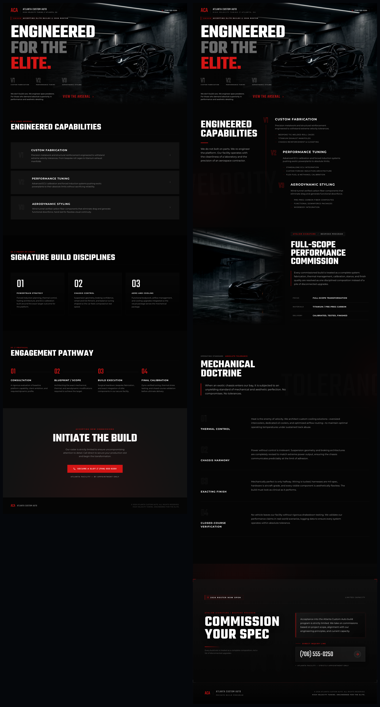
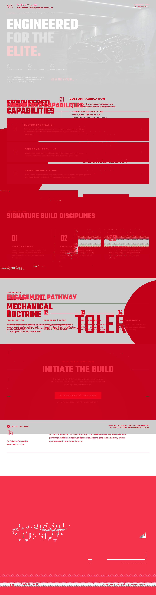

# Frontend Design Loop MCP

Design-first MCP for coding agents that need to start, fix, and materially improve websites.

Frontend Design Loop is built for Claude Code, Codex, Gemini CLI, Droid, OpenCode, and similar agents when the base model got the page functional but not yet sharp.

It is for three concrete jobs:
- start a stronger frontend from a weak first pass
- fix broken, generic, or under-designed sections with screenshot-grounded iteration
- verify the result with deterministic proof and artifact capture

## 60-second path

Public install right now:

```bash
pipx install git+https://github.com/alexalexalex222/frontend-design-loop-mcp.git
frontend-design-loop-setup --install-all-detected-clients
```

Local clone path:

```bash
git clone https://github.com/alexalexalex222/frontend-design-loop-mcp.git
cd frontend-design-loop-mcp
./scripts/setup.sh
```

Then use the design-first tool when you want the MCP to actively improve the page:

```text
frontend_design_loop_design(
  repo_path="/absolute/path/to/site",
  goal="make the homepage look materially more premium without breaking the current layout",
  provider="gemini_cli",
  model="gemini-3.1-pro-preview",
  preview_command="python3 -m http.server {port}",
  preview_url="http://127.0.0.1:{port}/index.html"
)
```

## What it actually does

Frontend Design Loop owns two workflows:

- `frontend_design_loop_design`
  - the builder / fixer / design-enhancement path
  - use this when the base model made the page work but the result still looks generic, weak, broken, or unfinished
- `frontend_design_loop_eval`
  - the proof path
  - use this when you already have the patch and want deterministic checks, screenshots, and artifacts

The default design contract is simple:
- one main `provider` + `model` lane by default
- planning, generation, refinement, vision, and section-creativity inherit that same lane unless you explicitly override them
- split-lane routing is opt-in only

## Why it exists

Most coding agents can get a site functional.
Fewer can make it look deliberate.
Even fewer can improve it against the rendered result instead of guessing from code alone.

Frontend Design Loop closes that gap by making screenshot-grounded design iteration cheap and repeatable.

## Whole-page proof

This is the kind of full-page upgrade the design-first path is meant to support.

Before: the first ugly ACA full-home version.


After: the rebuilt ACA version with a stronger hero, cleaner systems/specimen/doctrine sections, and a much better closing sequence.


Whole-page compare:



Whole-page diff:



This is the point of the product: not generic polish, but a measurable page-level change a host agent can use in real work.

## How it works

Typical design-first loop:
- the host agent points the MCP at a weak page, broken section, or rough patch
- Frontend Design Loop boots a local preview and captures screenshots
- the same main model lane iterates against the rendered result by default
- deterministic gates keep the output from regressing structurally
- the MCP returns the winning patch plus screenshot and run artifacts

Typical eval loop:
- the host agent already has the patch
- Frontend Design Loop applies it in an isolated worktree
- runs build, lint, tests, preview, and screenshot capture
- returns deterministic status plus artifacts for host judgment

## Install and client setup

### Public install

Use GitHub install until PyPI is published:

```bash
pipx install git+https://github.com/alexalexalex222/frontend-design-loop-mcp.git
frontend-design-loop-setup --install-all-detected-clients
```

### Local clone

```bash
./scripts/setup.sh
```

What the local setup does:
- creates `.venv`
- installs the package
- installs Playwright Chromium
- installs detected MCP client entries automatically when supported clients are present
- runs the built-in doctor
- runs the stdio smoke test

Skip automatic client installs if you want a dry setup:

```bash
FDL_SKIP_CLIENT_INSTALL=1 ./scripts/setup.sh
```

### Client installers

Fastest bulk path:

```bash
frontend-design-loop-setup --install-all-detected-clients
```

Targeted installers:

```bash
frontend-design-loop-setup --install-claude --scope user
frontend-design-loop-setup --install-codex
frontend-design-loop-setup --install-gemini
frontend-design-loop-setup --install-droid
frontend-design-loop-setup --install-opencode
```

Manual config printers:

```bash
frontend-design-loop-setup --print-claude-config
frontend-design-loop-setup --print-codex-config
frontend-design-loop-setup --print-gemini-config
frontend-design-loop-setup --print-droid-config
frontend-design-loop-setup --print-opencode-config
```

## Tool contracts

### `frontend_design_loop_design`

Use this when you want the MCP to actively make the design better.

Default behavior:
- `solver_mode="host_cli"`
- one main `provider` + `model` lane by default
- planner, design generation, vision, and section-creativity inherit that same lane unless explicitly overridden
- `planning_mode="single"`
- `vision_mode="on"`
- `section_creativity_mode="on"`

Use it when:
- the base model got the page functional but still generic
- a section works structurally but looks weak
- you need a real redesign pass instead of only validation

### `frontend_design_loop_eval`

Use this when the host agent already has the patch or can generate it itself.

It returns:
- `deterministic_passed`
- `vision_pending`
- `vision_scored`
- `final_pass`
- `run_dir`
- `candidate_dir`
- `screenshot_files`
- `patch`

## Safety defaults

Interactive-path safety:
- `test_command`, `lint_command`, and `preview_command` are parsed as shell-free argv by default
- shell operators and substitutions require `unsafe_shell_commands=true`
- direct interpreter escapes like `bash -c`, `sh -c`, `python -c`, and `node -e` also require `unsafe_shell_commands=true`
- `preview_url` must resolve to the exact launched local preview origin and port by default
- external preview fetches require `unsafe_external_preview=true`
- preview readiness checks reject cross-origin redirects, and browser screenshots block cross-origin subresources by default
- auto-context skips common secret-bearing files and directories by default, including `.env*`, `.git/`, `.aws/`, `.ssh/`, `.config/gcloud/`, `.docker/`, `.kube/`, token-named files, and service-account-style JSON
- native CLI providers inherit a minimal allowlisted environment instead of the full host env
- shared worktree reuse dirs are off by default; opt in only if you intentionally trade isolation for speed

Client-side vision is the default for `frontend_design_loop_eval`:
- no provider credentials required
- the host agent judges the screenshots
- Frontend Design Loop reports `vision_pending=true` until that judgment happens

Proxy-only automated vision lanes are explicitly downgraded:
- MiniMax proxy lanes (`kilo_cli`, `droid_cli`, `opencode_cli` on MiniMax) are treated as structural-only screenshot checks
- they report `vision_review_mode="proxy_structural"`
- they do not count as full automated visual scoring

## Verification

Offline preflight:

```bash
PYTHONPATH=src .venv/bin/python scripts/preflight_check.py
```

stdio smoke:

```bash
PYTHONPATH=src .venv/bin/python scripts/smoke_mcp_stdio.py
```

Built-in doctor:

```bash
frontend-design-loop-setup --doctor
frontend-design-loop-setup --doctor --smoke
```

## Environment variables

Primary env vars:
- `FRONTEND_DESIGN_LOOP_CONFIG_PATH`
- `FRONTEND_DESIGN_LOOP_MCP_OUT_DIR`
- `FRONTEND_DESIGN_LOOP_MCP_PORT_START`

## Repo layout

- `src/frontend_design_loop_mcp/`: packaged CLI entrypoints, runtime paths, bundled assets
- `src/frontend_design_loop_core/`: MCP runtime, deterministic gates, screenshot/vision plumbing, provider adapters
- `config/config.yaml`: default local-clone config
- `prompts/`: reasoning overlays and prompt packs
- `templates/`: default Next.js template used by the runtime
- `tests/`: MCP-focused regression suite

## Current distribution state

Current public install path:

```bash
pipx install git+https://github.com/alexalexalex222/frontend-design-loop-mcp.git
```

PyPI is not published yet.
When that changes, the public install path should become:

```bash
pipx install frontend-design-loop-mcp
```
