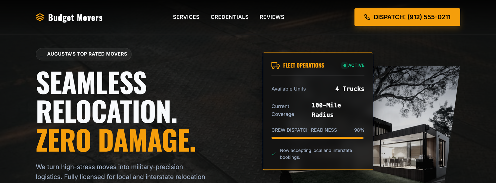
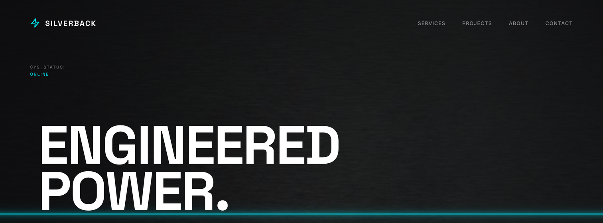
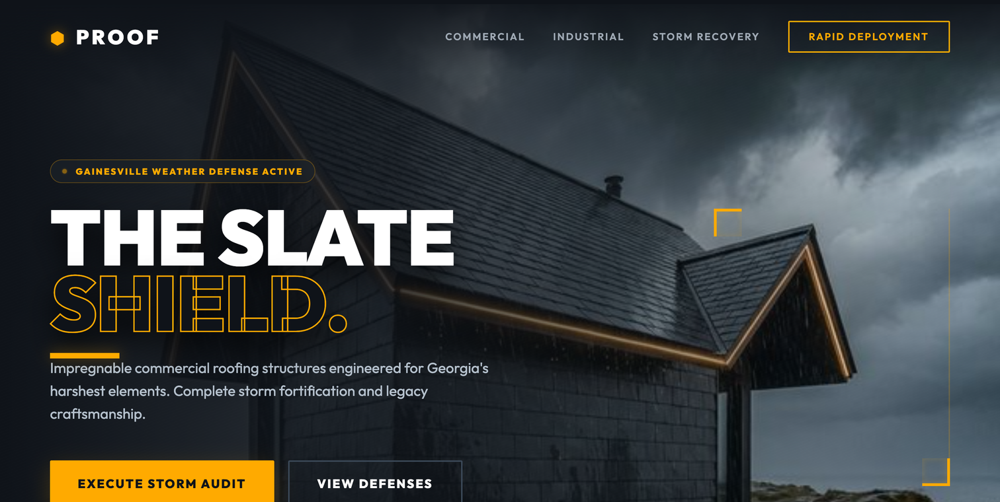
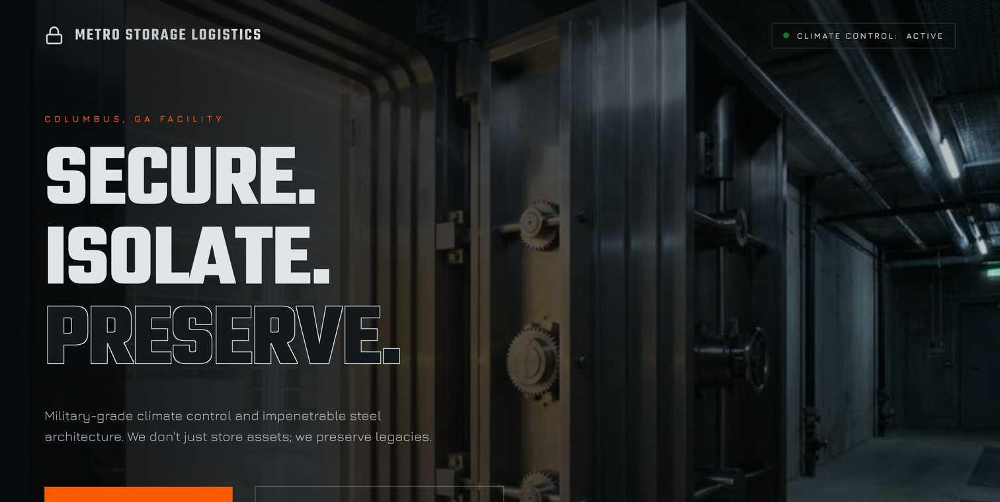
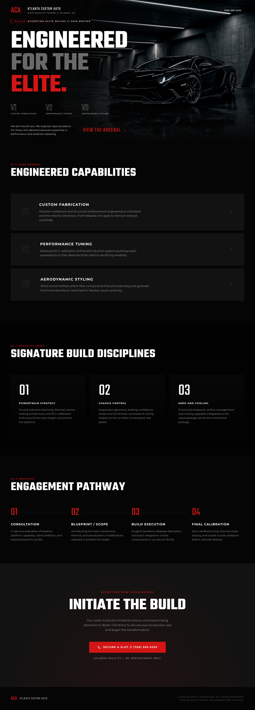

# Frontend Design Loop MCP

<!-- mcp-name: io.github.alexalexalex222/frontend-design-loop-mcp -->

Give your coding agent local previews, responsive images, focused browser checks,
and evidence it can inspect while improving a frontend. Works with any MCP client
that supports local stdio servers. Python 3.10+; Windows, macOS, and Linux.

## Quick start: host-agent toolkit

These instructions describe the **local upgrade**, which has not been published.
From this checkout, create a project environment and install:

```sh
python -m venv .venv
```

On macOS/Linux:

```sh
.venv/bin/python -m pip install -e .
.venv/bin/frontend-design-loop-setup
.venv/bin/frontend-design-loop-setup --print-config
```

On Windows PowerShell:

```powershell
.venv\Scripts\python.exe -m pip install -e .
.venv\Scripts\frontend-design-loop-setup.exe
.venv\Scripts\frontend-design-loop-setup.exe --print-config
```

Use `python3` or `py -3` for environment creation if that is your Python launcher.
Setup downloads Playwright Chromium into this Python environment. It prints next
steps and leaves MCP client settings alone. Linux may need system browser libraries;
see [troubleshooting](docs/TROUBLESHOOTING.md).

Copy the printed JSON into your client's MCP configuration. For client-specific
formats, use `--print-codex-config`, `--print-claude-config`, or
`--print-opencode-config`. The generated config binds to the current environment's
absolute Python path, so it also works when a desktop client has a different PATH.
Keep that environment in place. Restart the client after adding the config.

Only explicit `--install-*` flags write client settings. Existing flags for Claude,
Codex, Gemini, Droid, OpenCode, and `--install-all-detected-clients` remain available.
File installers preserve unrelated settings, refuse conflicting unmanaged entries,
validate the result, and replace it atomically. OpenCode JSONC is parsed and written
as JSON, preserving values but removing comments and formatting.

## Toolkit or automated server

| Workflow | Entrypoint | Who edits and reviews? |
| --- | --- | --- |
| Host-agent toolkit (default) | `frontend-design-toolkit-mcp` | Your host agent uses its own tools and image capability |
| Automated loop (explicit) | `frontend-design-loop-mcp` | Configured providers generate/refine and optionally judge |

The toolkit needs **no model, CLI subscription, or API credentials**. Your host
agent supplies the intelligence. It exposes `get_playbook`, `build_context`,
`run_gates`, `preview_start`, `capture_screenshots`, and `preview_stop`.
An explicit optional `review_design` call uses a separately selected native CLI judge;
the mechanical toolkit itself invokes no model.

Give the host a concrete brief, for example:

> Improve this homepage for first-time customers booking a repair. Preserve verified
> copy and the booking flow. Read the solve playbook, capture the baseline at desktop
> and mobile widths, make the edits, test the menu and booking entry, and show the
> resulting images and checks. Preserve the best source state while iterating.

Mechanical calls look like:

```text
get_playbook(name="solve")
preview_start(command=["python", "-m", "http.server", "{port}", "--bind", "127.0.0.1"], cwd="/absolute/path/to/site")
capture_screenshots(url="<returned local URL>", evidence_label="baseline")
run_gates(repo_path="/absolute/path/to/site", test_command=["npm", "test"])
preview_stop(pid=<returned owned PID>)
```

Use the project's actual interpreter/preview command; argv arrays avoid Windows
path quoting problems. Test and lint absence is **skipped**, with `*_ok=null`.
Read the [workflow reference](docs/FRONTEND_DESIGN_LOOP_MCP.md) for interaction steps,
evidence manifests, and copyable client config examples.

For the automated loop, add `--workflow automated` to any setup print/install flag:

```sh
frontend-design-loop-setup --workflow automated --print-codex-config
```

Select provider, model, effort, and authentication policy explicitly in the tool
call/configuration using settings supported by your installed CLI. Native CLI flow
uses an existing CLI login; no API key is required for a supported native route.
Setup never changes login state or your default provider/model. Cloud adapters
remain optional: install `.[cloud]` locally (or `frontend-design-loop-mcp[cloud]`
after this upgrade is released). The automated server offers
`frontend_design_loop_design`, `frontend_design_loop_eval`, and
`frontend_design_loop_solve`; inspect their tool schemas for current options.

A native automated call can use different models for editing and review:

```json
{
  "repo_path": "/absolute/path/to/site",
  "goal": "Improve the booking page for first-time customers while preserving its working submission flow.",
  "provider": "codex_cli",
  "model": "gpt-6.1-sol",
  "builder_effort": "high",
  "vision_provider": "claude_cli",
  "vision_model": "claude-opus-5-5",
  "judge_effort": "high",
  "auth_mode": "subscription",
  "preview_command": ["npm", "run", "dev", "--", "--port", "{port}"],
  "preview_url": "http://127.0.0.1:{port}",
  "worktree_setup_command": ["npm", "ci", "--ignore-scripts"],
  "design_scope": "refine"
}
```

Pass that payload to `frontend_design_loop_design`. Choose model identifiers and
exact effort levels advertised by your installed CLI and available to your account;
these examples are not an entitlement guarantee. Configure `refiner_provider`,
`refiner_model`, and `refiner_effort` independently when needed. No hidden model or
provider fallback occurs. Subscription mode supports native Codex, first-party
Claude Code, and verified native OpenAI OAuth routes in OpenCode. API or other CLI
adapters require explicit `auth_mode="configured"` and optional dependencies.

Automation edits directly in disposable Git worktrees by default. Set
`editing_mode="patch"` for structured patches, supplying `context_files` or automatic
context selection. It snapshots retained dirty working contents without changing your
index, captures a comparable baseline, and verifies that delivered changes reproduce
the chosen candidate. `worktree_setup_command` installs dependencies inside each
isolated worktree; use the project's actual command. Optional `worktree_reuse_dirs`
shares directories through symlinks and is an explicit tradeoff rather than a default.
Ignored files, generated untracked outputs, and sensitive untracked names are excluded
and recorded. Ignored environment files are not copied into worktrees. Secrets
embedded in ordinary source are outside this name-based policy.

For clients with short call deadlines, use `frontend_design_loop_start` with
`repo_path`, `goal`, and a `settings` object containing the design options above
(excluding repo_path/goal), then poll `frontend_design_loop_status` or cancel with
`frontend_design_loop_cancel`. Jobs last for the running server's lifetime.
Native execution records distinguish requested settings, runtime observations, and
unsupported controls. An effective model/effort remains unknown when the CLI does
not provide a receipt; native temperature/token caps are not pretended to work.

The optional toolkit reviewer takes the `manifest_path` returned by capture:

```text
review_design(manifest_path="<candidate manifest>", baseline_manifest_path="<baseline manifest>",
              goal="<audience and task>", provider="claude_cli", model="claude-opus-5-5", effort="high")
```

It verifies image hashes and labels before review. Claude's judge must show successful
native reads of every supplied screenshot. The judge does not receive the passing
threshold in its prompt. Missing or malformed evidence stays uncertain/error; a
code diff cannot certify rendered UI quality. Already passing designs skip polish,
and unsuccessful or regressing refinements restore the better inspected state.

## Evidence and limits

Each toolkit capture gets a fresh directory containing PNGs and `manifest.json`.
Images are returned as MCP image content, subject to a bounded return size. Clients
must support image blocks and the host model must actually inspect them. Manifests
label viewport/state, image hashes, requested interactions, console errors,
horizontal overflow, and passed/failed/not_run/error results. A caller-supplied
source revision is a label; the toolkit does not verify a source snapshot.

Screenshots do not prove quality, human preference, accessibility, factual accuracy,
or successful untested flows. A high self-score is not independent review. Use a
separate authorized reviewer when useful, preserve baseline and best source states,
and tie acceptance to the audience's task and the requested scope. The gallery below
is illustrative historical work, not a controlled benchmark of this upgrade.

Toolkit previews are owned process trees with drained bounded logs. Unknown PIDs
are rejected. Preview/screenshot document URLs must stay on the requested loopback
origin; remote image/font/script assets may load. Commands and those assets run
with local user privileges; origin checks are not an execution sandbox. Context
packing excludes common credential files and redacts familiar secret patterns;
inspect sensitive projects before sharing evidence.

## Verify your installation

```sh
frontend-design-loop-setup --check
frontend-design-loop-setup --doctor
frontend-design-loop-setup --doctor --smoke
frontend-design-loop-setup --auth-check
```

Doctor distinguishes CLI installation, unknown/authenticated/unauthenticated state,
auth-probe execution, and **live inference not_run**. Auth probes are opt-in,
bounded status commands; raw account output is not printed. Authentication does
not prove model entitlement, native billing route, or inference success. Native
CLIs are optional for the toolkit. Toolkit stdio smoke works from the installed
package and invokes no model; automated render smoke is a checkout developer check.

### Windows launch troubleshooting

Use Git on `PATH` and install Playwright Chromium in the same Python environment as the server.
If a `uv` launcher reports `uv trampoline failed to canonicalize script path` outside a
sandboxed desktop profile, launch the server with that environment's Python instead:

```text
<venv>\Scripts\python.exe -m frontend_design_loop_mcp.mcp_server
```

The prepared `portability` CI job runs the complete suite on Windows Server 2022
and 2025, macOS, and Linux with Python 3.10, 3.12, and 3.14. A Windows 11 ARM host
also exercises x64 Python/Node under emulation; native ARM64 application support
is not established. Native Windows tests exercise Job Object ownership, inherited
stdio, descendant cleanup, timeout/cancellation, command quoting, and physical
source replay.

Each platform builds distributions and checks fresh pip wheel and `uv tool` source
installs outside the checkout. Those checks run both MCP servers, an actual `npm`
preview, desktop/mobile form interactions, screenshot hashes, and port release.
They invoke no model and preserve JSON receipts, test results, logs, and images.
Hosted execution of this local upgrade is still pending; configured checks do not
establish a passing Windows release. See [Windows verification](docs/WINDOWS_VERIFICATION.md).


## Proof Gallery

The public proof set uses owned/generated GA SMB previews plus the ACA full-page before/after.

### Selected Hero / Top Crops

<table>
  <tr>
    <td align="center"><br><sub>11 Budget Movers Augusta</sub></td>
    <td align="center"><br><sub>13 Peachtree Flooring Atlanta</sub></td>
    <td align="center"><br><sub>19 TNT Cabinets Columbus</sub></td>
  </tr>
  <tr>
    <td align="center"><br><sub>21 Henry Plumbing Savannah</sub></td>
    <td align="center"><br><sub>22 Silverback Electric Savannah</sub></td>
    <td align="center"><br><sub>25 Robins Body &amp; Paint Warner Robins</sub></td>
  </tr>
  <tr>
    <td align="center"><br><sub>34 Proof Roofing Services Gainesville</sub></td>
    <td align="center"><br><sub>45 Metro Storage Columbus</sub></td>
    <td align="center"><br><sub>47 Miller Light Construction Commerce</sub></td>
  </tr>
</table>

### ACA Full-Page Before / After

Before: early ACA full homepage.



After: later ACA homepage revision, shown for visual comparison.


See the proof notes in [the case studies index](docs/case-studies/index.md).


## Documentation

- [Workflow and client configs](docs/FRONTEND_DESIGN_LOOP_MCP.md)
- [Troubleshooting](docs/TROUBLESHOOTING.md)
- [Historical case studies](docs/case-studies/index.md)
- [Release checklist](docs/LAUNCH_CHECKLIST.md)

Client formats are based on [Codex MCP documentation](https://developers.openai.com/codex/mcp),
[Claude Code MCP documentation](https://code.claude.com/docs/en/mcp), and
[OpenCode MCP documentation](https://opencode.ai/docs/mcp-servers/).

PyPI remains the published installation channel (`pipx install frontend-design-loop-mcp`),
but that command installs the published version, not these unreleased local changes.
Registry metadata is tracked in [server.json](server.json); no publication is part
of this upgrade.
