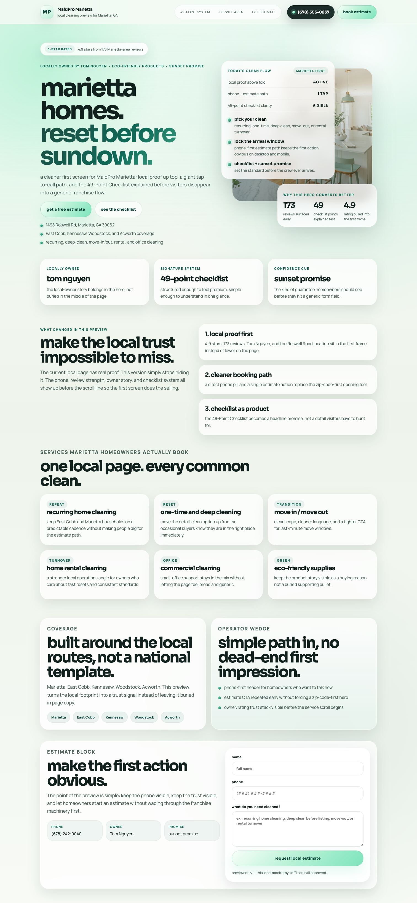
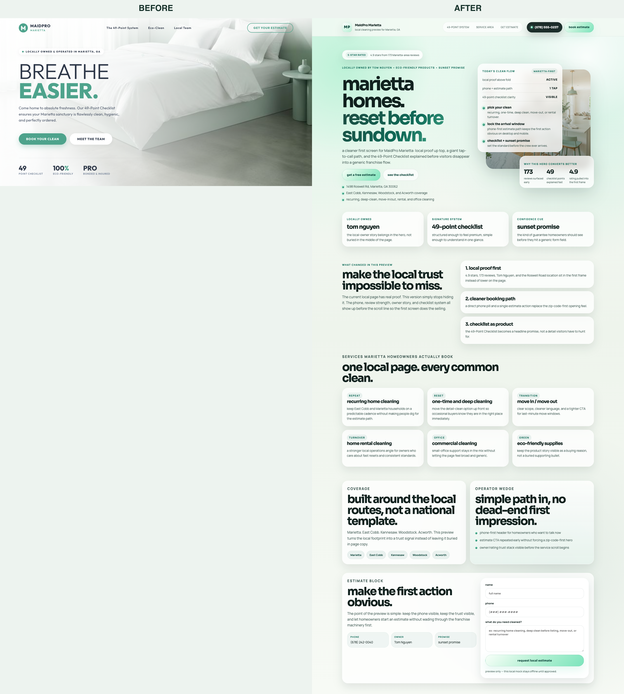

# MaidPro Marietta

MaidPro is the AI-generated-page case. The original root concept was clean enough to render, but it was basically a single soft hero with weak local proof, shallow service framing, and almost no page-level selling structure. The rebuilt version turns it into a full local-service page with real hierarchy and concrete trust anchors.






## What was wrong

- The original concept was mostly one screen: soft aesthetic, thin proof, and not enough substance to sell the local operation.
- The strongest Marietta-specific trust points were not doing enough work on the page: owner identity, review count, checklist framing, coverage, and a cleaner estimate path.

## What changed

- The rebuild made the page local and proof-heavy: phone pill, review count, owner callout, checklist productization, service cards, coverage blocks, and a clearer estimate box.
- It also fixed the "one pretty screen" problem by turning the concept into a complete page that keeps its visual system while adding enough structure to sell the offer.

## Why it matters

This is the AI-generated-to-materially-better case study. It shows the difference between a page that merely looks calm and a page that actually carries trust, offer framing, and next-step clarity.

## Proof notes

- Before state: the original weak AI-generated root page from `37-maidpro-marietta/index.html`, captured as a full-page proof on 2026-03-08.
- After state: the rebuilt `37-maidpro-marietta/v2/` page, captured as a full-page proof on 2026-03-08.
- The original live-site outreach capture hit a Cloudflare verification screen, so the strongest honest headline proof here is root generated before -> rebuilt after.

## Source build provenance

- Source before folder: `37-maidpro-marietta/`
- Source after folder: `37-maidpro-marietta/v2/`
- Stored source manifest model: `gpt-5`
- Stored source manifest provider: not separately persisted in that handoff
- Frontend lane target in the planning packet: screenshot-first build with Gemini 3.1 Pro
- Build provenance is preserved in the private source workspace; the public repo keeps the proof images and the equivalent MCP call instead of internal handoff paths.

## Equivalent Design Call

```text
frontend_design_loop_design(
  repo_path="/absolute/path/to/site",
  goal="replace a weak one-screen cleaning concept with a stronger local-service homepage that brings phone, reviews, owner proof, checklist framing, and estimate clarity above the fold",
  provider="gemini_cli",
  model="gemini-3.1-pro-preview",
  preview_command="python3 -m http.server {port}",
  preview_url="http://127.0.0.1:{port}/index.html"
)
```
