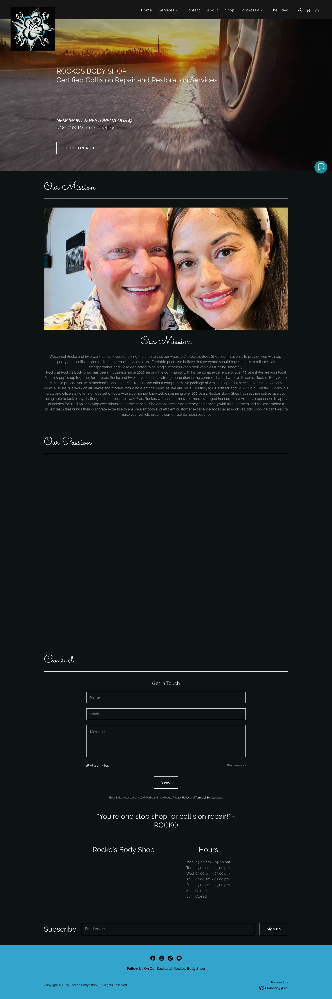
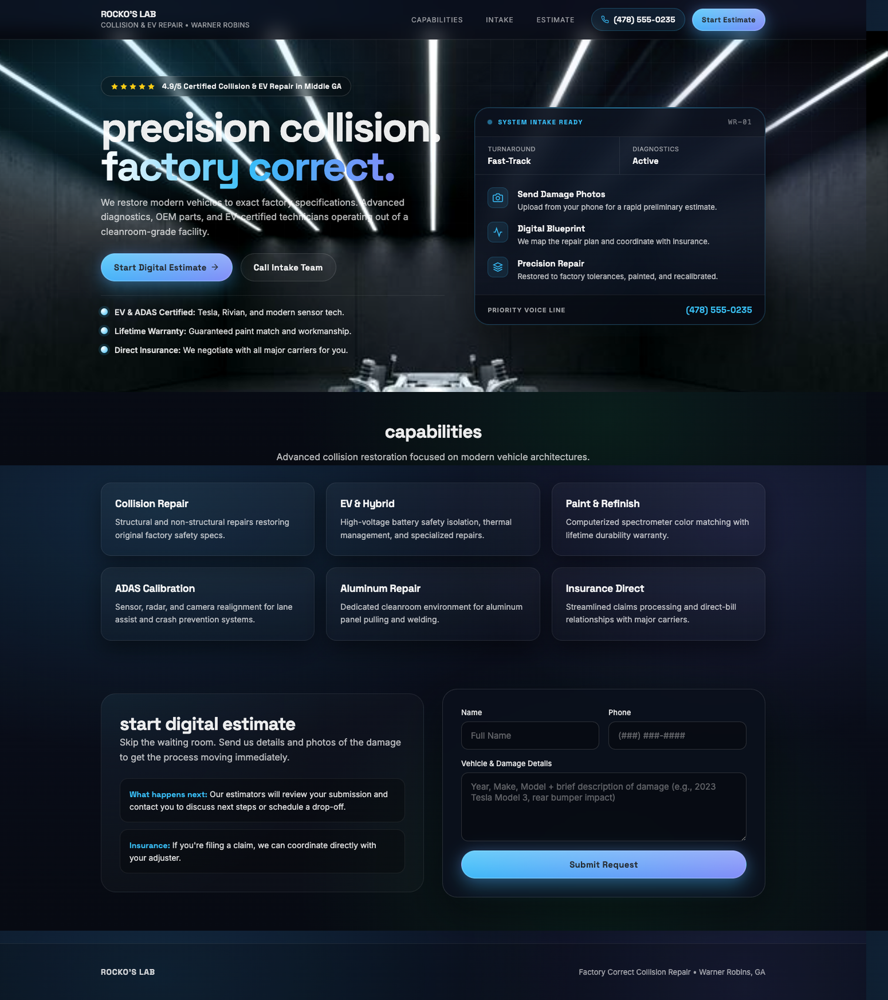

# Rocko's Body Shop

Rocko's is the honest ugly-but-functional example. The live site worked, but the first screen was thin, the layout fell apart below the fold, and the contact flow looked underbuilt for a collision shop trying to earn trust fast.






## What was wrong

- The live page opened with a dark hero and basic copy, but it did not signal premium collision expertise or make the next action feel obvious.
- Below the hero, the site drifted into sparse sections, weak hierarchy, and a low-confidence contact block.

## What changed

- The rebuild moved the page into a higher-trust intake shape: visible phone pill, stronger headline lockup, trust strip, and a system-style right rail.
- The rest of the page tightened into cleaner capability cards and a clearer estimate form so the whole page reads like a real intake surface instead of a placeholder brochure.

## Why it matters

This is the kind of proof the product needs: not a tiny hero tweak, but a whole-page change where the after state feels materially more deliberate on first render.

## Proof notes

- Before state: real full-page capture from `35-rockosbodyshop.com`, preserved from the GA SMB proof bundle captured on 2026-02-25.
- After state: full-page capture recreated on 2026-03-08 from `35-rockos-body-shop-warner-robins/v5-gemini-real-top3-upgrade/`.

## Source build provenance

- Source folder: `35-rockos-body-shop-warner-robins/v5-gemini-real-top3-upgrade/`
- Source lane: Gemini builder lane
- Stored source manifest model: `gemini-3.1-pro-preview`
- Build provenance is preserved in the private source workspace; the public repo keeps the proof images and the equivalent MCP call instead of internal handoff paths.

## Equivalent Design Call

```text
frontend_design_loop_design(
  repo_path="/absolute/path/to/site",
  goal="turn a dark but weak collision-shop homepage into a tighter, higher-trust intake page with a visible phone pill, stronger hero hierarchy, and a system-style right rail",
  provider="gemini_cli",
  model="gemini-3.1-pro-preview",
  preview_command="python3 -m http.server {port}",
  preview_url="http://127.0.0.1:{port}/index.html"
)
```
